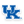

# CFB Rankings

This is a simple resume-based algorithm I developed for ranking college football
teams. It just uses wins and losses.

* Preaseason rankings can bias a poll's effectiveness. To overcome
  this, this algorithm uses randomly generated preaseason rankings. 
* In most polls a recent win or loss tends to be counted more strongly than
  earlier wins. This algorithm randomly shuffles the records of all
  games in order to alleviate this problem.
* Only wins and losses are counted in the algorithm
  (see below).  Strength of schedule is built in, because winning against a team
  ranked higher in an iteration moves your team up.

See `[docs/about.md](docs/about.md)` for more information on how to
compile the program and how the algorithm works. 

After 7 weeks of play in the 2017-2018 season:

 **Rank** |  | **Team**                  | **Record** | **Score**  
----------|--|-------------------------|------------|------------
1 |  |  Alabama                   |  7-0       |   0.656094
2 |  |  Georgia                   |  7-0       |   0.639660
3 |  |  Penn State                |  6-0       |   0.635700
4 |  |  Wisconsin                 |  6-0       |   0.633779
5 |  |  TCU                       |  6-0       |   0.623445
6 |  |  USC                       |  6-1       |   0.619119
7 |  |  Clemson                   |  6-1       |   0.617413
8 |  |  UCF                       |  5-0       |   0.616993
9 |  |  Ohio State                |  6-1       |   0.613780
10 |  |  South Florida             |  6-0       |   0.606025
11 |  |  Miami (FL)                |  5-0       |   0.603985
12 |  |  Michigan State            |  5-1       |   0.601154
13 |  |  North Carolina State      |  6-1       |   0.601148
14 |  |  Michigan                  |  5-1       |   0.598193
15 |  |  San Diego State           |  6-1       |   0.597598
16 |  |  Notre Dame                |  5-1       |   0.597356
17 |  |  Washington                |  6-1       |   0.594634
18 |  |  Navy                      |  5-1       |   0.594476
19 |  |  Washington State          |  6-1       |   0.594250
20 |  |  Oklahoma                  |  5-1       |   0.591778
21 |  |  Oklahoma State            |  5-1       |   0.590952
22 |  |  Marshall                  |  5-1       |   0.586148
23 |  |  Memphis                   |  5-1       |   0.582925
24 |  |  Stanford                  |  5-2       |   0.581243
25 |  |  Kentucky                  |  5-1       |   0.577906

[Full rankings](output/rankings.csv)

*Note*: These results do not include the Akron-W. Michigan game, yet to
be played on October 15, 2017.
